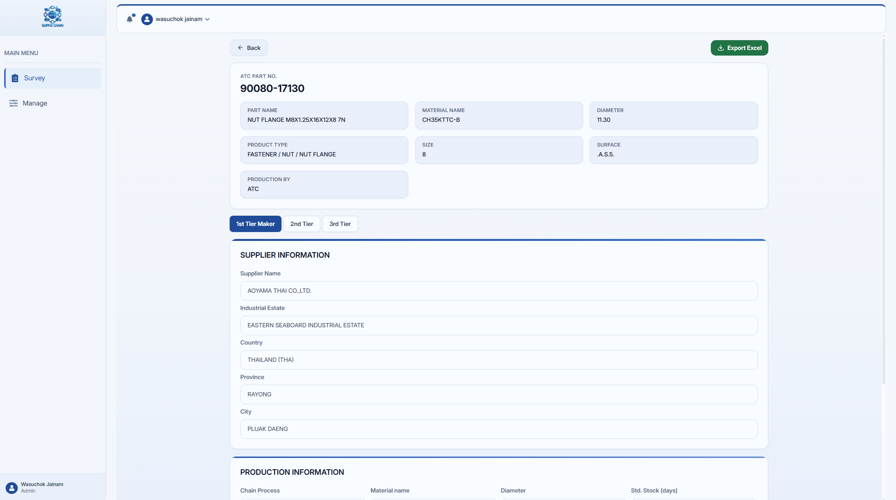

# Aoyama Supply Chain

โปรเจกต์เว็บแอปสำหรับงานซัพพลายเชนของ Aoyama สร้างด้วย Next.js และ React

## Screenshots




## Tech Stack

- Next.js 15 (App Router)
- React 19
- Tailwind CSS
- TypeScript

## Getting Started

ติดตั้งแพ็กเกจและรันเซิร์ฟเวอร์สำหรับพัฒนา:

```bash
npm install
npm run dev
```

เปิดเบราว์เซอร์ที่ `http://localhost:3000`

## Scripts

```bash
npm run dev     # Run dev server
npm run build   # Build for production
npm run start   # Start production server
```

## Environment

ถ้าต้องใช้ตัวแปรแวดล้อม ให้สร้างไฟล์ `.env.local` ที่ root ของโปรเจกต์
